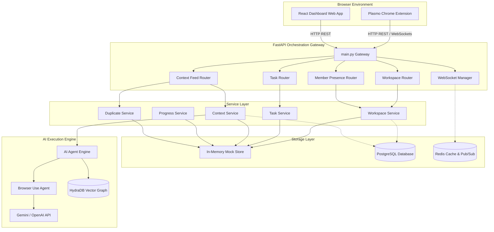
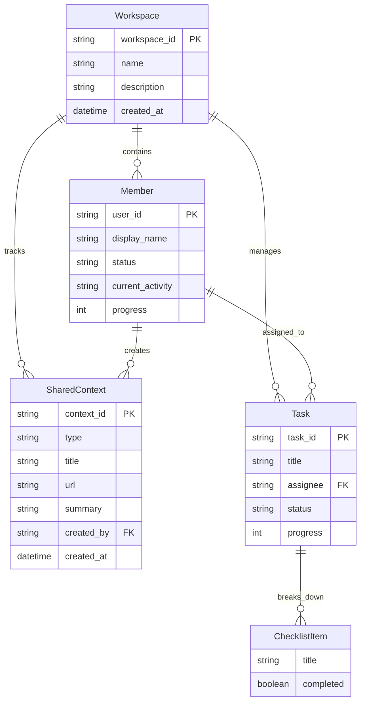

# TeamOS - System Architecture

## 1. System Overview
TeamOS is a browser-native collaborative work operating system that enables asynchronous and real-time team context sharing. The platform is built around a React/Plasmo Chrome Extension that runs in the browser sidebar, communicating via HTTP REST and WebSockets with a modular FastAPI backend. Persistent knowledge and AI operations are managed by a Python AI engine orchestrating LLM summarizers and a semantic relationship graph database (HydraDB).

## 2. High-Level Architecture Diagram

The diagram below outlines the flow of events from the browser client down to the database and external integration points:

## 3. Component Breakdown

| Module | Location | Responsibility |
| :--- | :--- | :--- |
| **Chrome Extension** | `apps/extension` | Captures active browser tab metadata, screenshots, text selections, context menus, and manages the team presence sidebar widget. |
| **Dashboard Web App** | `apps/dashboard` | Main SPA dashboard displaying team presence timelines, sprint progress heatmaps, visual knowledge graphs, and workspace settings. |
| **Orchestration Backend** | `apps/backend` | Exposes REST validation schemas and handles client WebSocket rooms, routing API request payloads to corresponding domain services. |
| **AI Engine** | `apps/ai-engine` | Spawns background worker instances for LLM-driven competitor research agents (Browser Use) and extracts relationship nodes. |
| **Shared Types / SDK** | `packages/` | Monorepo npm packages facilitating type safety (`packages/types`) and unified fetch hooks (`packages/sdk`) shared between extension and dashboard. |

## 4. Data Flow (Webpage Sharing Lifecycle)

1. **Trigger**: A team member right-clicks a webpage and selects **"Share to Team"** (or highlights text and shares).
2. **Client Dispatch**: The content script captures the URL, title, and selected text, making a `POST /context/share` API request to the FastAPI gateway.
3. **Validation**: The gateway validates the payload against `ContextShare` Pydantic model schemas.
4. **Duplicate Analysis**: The `ContextService` passes the text/title to `DuplicateService`, running similarity checks against already indexed assets in the store (or vector DB).
5. **AI Summarization**: The item is queued for background summarization (LLM summarization agent).
6. **Persistence**: The metadata and summary are persisted to the data store (MemoryStore/PostgreSQL).
7. **Broadcast**: The backend publishes a `PAGE_SHARED` WebSocket event to all members connected to the active workspace room, updating their feed real-time (< 500ms).

## 5. Data Model / Schema

## 6. Tech Stack Table

| Layer | Technology | Why |
| :--- | :--- | :--- |
| **Extension Framework** | Plasmo + React + TS | Streamlines manifest configuration, background service workers, and bundle isolation. |
| **Frontend Framework** | Vite + React + TS | Fast building, hot module replacement, and monorepo capability. |
| **Backend Gateway** | FastAPI + Python | Asynchronous routing, auto-generated OpenAPI documentation, and native Pydantic validation. |
| **Caching & Pub/Sub** | Redis | High throughput presence cache and WebSocket broadcast queue. |
| **Relational Database** | PostgreSQL | Handles workspaces, tasks, context feeds, and core relational metadata. |
| **Vector Database** | HydraDB | Dual-engine vector similarity (for duplicate check) and semantic entity graph traversal. |
| **AI Orchestration** | Browser Use | Native browser automation agent using LLM inputs to search and interact like a teammate. |

## 7. Key Design Decisions & Tradeoffs

- **In-Memory Store Scaffold**: We utilized a centralized thread-safe in-memory memory store (`MemoryStore`) for this MVP iteration. *Tradeoff*: No persistent storage across backend app restarts, but enables immediate frontend interaction and test suite run without local DB environment blockers during demos.
- **WebSocket Broadcast Room Scoping**: The `/ws/{workspace_id}` endpoint and `ConnectionManager` (`apps/backend/app/websocket/`) group connections into per-workspace rooms, but since `MemoryStore` entities aren't yet tagged with a `workspace_id`, callers currently use `broadcast_all()` (fan-out to every connected room) rather than the room-scoped `broadcast()`. *Tradeoff*: Correct for the single-demo-workspace MVP, but not yet workspace-isolated — tag entities with `workspace_id` before adding a second real workspace.
- **In-Process Pub/Sub, Not Redis Yet**: The WebSocket layer is real (FastAPI native `WebSocket` + an in-memory `ConnectionManager`), but broadcasts only reach clients connected to the same backend process — Redis Pub/Sub is not wired in yet. *Tradeoff*: Fine for a single-instance hackathon deploy; required before running multiple backend replicas.
- **HydraDB Local Fallback**: `apps/backend/app/services/hydra_service.py` implements the vector-similarity and knowledge-graph interface locally (cosine similarity over bag-of-words vectors, in-memory graph) since no HydraDB credentials/SDK are configured yet. *Tradeoff*: Duplicate detection only catches near-identical wording, not true semantic similarity, until the real HydraDB client is wired in behind the same interface.
- **Plasmo Extension Structure**: Used Plasmo's built-in framework. *Tradeoff*: Strict folder naming guidelines, but takes care of build configurations for MV3 service workers out-of-the-box.

## 8. Known Limitations & Scaling Considerations

- **Redis WebSocket Bottleneck**: For high concurrent connections, a single Redis instance handling Pub/Sub room routing may hit a network I/O limit. *Mitigation*: We recommend scaling horizontally using Redis Sentinel or moving to Apache Kafka as the workspace count grows.
- **LLM Token Costs for Summarization**: Generating summaries on every single URL visit/share will incur substantial LLM provider costs and token exhaustion. *Mitigation*: Implement a debounce or click-to-summarize button instead of automated background summarization.
- **Memory Store Ephemerality**: Current workspace databases are non-persistent. *Mitigation*: Swap the `MemoryStore` data connectors in the Service Layer with SQLAlchemy/Postgres repositories using repository patterns.
