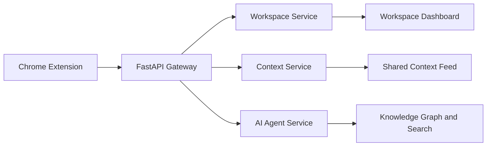
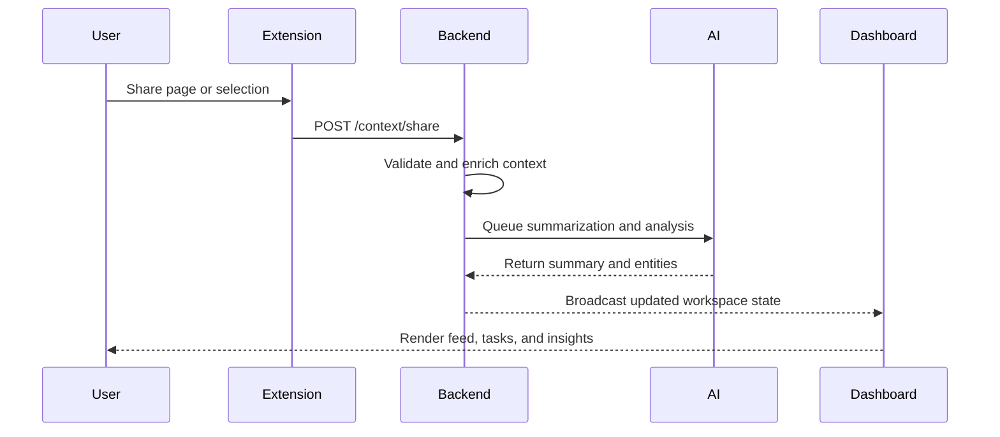

# TeamOS Diagrams

This document holds the core visual maps for the working TeamOS product. The diagrams below show the end-to-end flow from browser context capture to workspace intelligence.

## System Overview

## End-to-End Collaboration Flow

## Product Surface Map

- Browser extension: capture context and launch actions
- Dashboard: review workspace state, tasks, presence, and AI outputs
- Backend: route requests, validate payloads, and coordinate services
- AI layer: summarize, analyze, and extract structured knowledge

