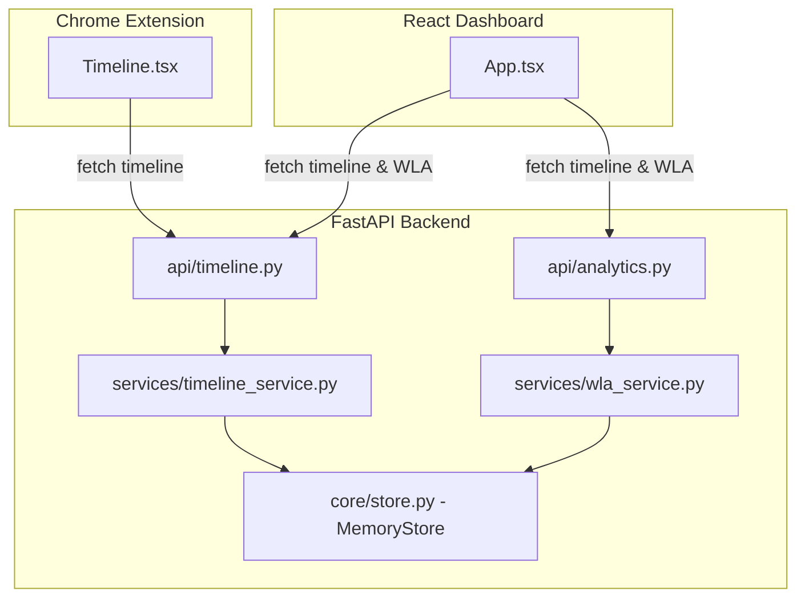

# Implementation Plan: Timeline & Workload Analysis (WLA)

This plan maps the **Timeline** and **Workload Analysis (WLA)** requirements specified in the PRD ([TeamOS-PRD.docx](file:///c:/Users/dell/TeamOs/TeamOS-PRD.docx) / [prddoc.txt](file:///c:/Users/dell/TeamOs/prddoc.txt)) to the codebase and outlines the concrete steps to implement them.

---

## 📋 Requirements Mapping (From PRD)

### 1. Timeline (FR-37 to FR-39)
* **Chronological Recording (FR-37)**: Storing all workspace events (context shares, task status changes, AI runs, member joins/leaves).
* **Sprint Replay (FR-38)**: Replaying events chronologically.
* **Filtering (FR-39)**: Ability to filter by member, date, task type, or document.
* **Extension UI (FR-8.3)**: Accessible via the persistent Chrome Extension sidebar.

### 2. Availability Timeline, Heatmap & Workload (FR-7, FR-8, FR-45 to FR-47)
* **Availability Timeline (FR-7)**: Users define working hour windows. System computes overlap hours, meeting suggestions, and sprint windows.
* **Team Heatmap (FR-8)**: Visual matrix of member states (Online / Busy / Offline) across working days/hours.
* **Workload Detection (FR-46)**: Automatically flags overloaded members (e.g., too many active tasks or high total progress weight).
* **Idle Detection (FR-47)**: Detects inactive members in the workspace.

---

## 🔍 Codebase Gap Analysis

| Component | What Exists | What is Missing (Gaps) |
| :--- | :--- | :--- |
| **FastAPI Backend** | 🟡 Simple mock service in [timeline_service.py](file:///c:/Users/dell/TeamOs/apps/backend/app/services/timeline_service.py) that pulls static in-memory context shares and tasks. | 🔴 No persistent logging of events. 🔴 No workload, overlap, or heatmap analytics endpoints. 🔴 No filters (except simple `user_id` query). 🔴 No sprint replay endpoint. |
| **Workspace Dashboard** | 🟡 Main page contains a static "Feed" view and a list of members. | 🔴 No Timeline tab or visual list view. 🔴 No workload graphs, heatmap grid, or overload/idle warning cards. |
| **Chrome Extension** | 🔴 Empty skeleton in [Timeline.tsx](file:///c:/Users/dell/TeamOs/apps/extension/src/sidepanel/Timeline.tsx) rendering just `
TeamOS Timeline
`. | 🔴 No integration with backend timeline services. 🔴 No event stream hookup. |

---

## 🛠️ Proposed Changes

### 1. [Component] FastAPI Backend

#### [MODIFY] [timeline_service.py](file:///c:/Users/dell/TeamOs/apps/backend/app/services/timeline_service.py)
* Add a persistent list of `db.events` in `MemoryStore` to dynamically record all lifecycle actions (e.g., logging when a task is created/updated, a document is shared, or a workspace is created).
* Implement advanced timeline filtering by date, event type (`context_share`, `task_update`, `ai_agent_run`), and user.
* Create a `/timeline/replay` endpoint that returns events in progressive time slices for the playback feature.

#### [NEW] [wla_service.py](file:///c:/Users/dell/TeamOs/apps/backend/app/services/wla_service.py)
* Create a service to calculate Workload Analysis:
  - **Overload Detection**: Flag members with `> 2` tasks in-progress or whose total task weight exceeds limits.
  - **Idle Detection**: Flag members with `0` tasks assigned or no recent activity logged.
  - **Availability Overlap**: Compute common hours between members based on their registered availability intervals.
  - **Meeting suggestions**: Recommend optimal times when all or most members have overlapping availability.

#### [NEW] [analytics.py](file:///c:/Users/dell/TeamOs/apps/backend/app/api/analytics.py)
* Expose endpoints for:
  - `GET /workspace/{workspace_id}/analytics/wla` (returns overlap hours, workload stats, idle flags, and suggestions).
  - `GET /workspace/{workspace_id}/analytics/heatmap` (returns hour-by-hour availability grid representation).

---

### 2. [Component] React Dashboard

#### [MODIFY] [App.tsx](file:///c:/Users/dell/TeamOs/apps/dashboard/src/App.tsx)
* Add a **Timeline & WLA** section inside the workspace tab, containing:
  - **Availability Overlap & Heatmap**: A visual grid/table displaying teammate availability across days, highlighting suggested overlap meeting windows.
  - **Workload Warnings**: Banner cards alerting when a member is flagged as overloaded (e.g. John Doe has too many active tasks) or idle.
  - **Chronological Timeline Feed**: A dedicated, filterable list of events with options to filter by User or Event Type.

---

### 3. [Component] Chrome Extension

#### [MODIFY] [Timeline.tsx](file:///c:/Users/dell/TeamOs/apps/extension/src/sidepanel/Timeline.tsx)
* Replace the skeleton with a functional component that fetches chronological events from `GET /timeline/` and renders them in a compact, scrollable list suitable for the Chrome sidebar.

---

## 🧪 Verification Plan

### Automated Tests
* Create unit tests in `apps/backend/tests/test_analytics.py` to verify:
  - Correct overlap calculation between availability intervals.
  - Correct overload triggering based on active task counts.
  - Correct idle state flagging.

### Manual Verification
* Deploy the updated dashboard and extension.
* Switch simulator view (e.g., view as Soumyadeep / John Doe), assign multiple tasks to trigger an overload alert, and verify the workload analysis dashboard updates dynamically.
* Use the filter buttons on the timeline page to narrow down events by user or action type.
